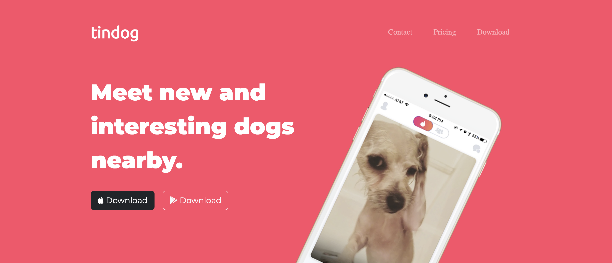
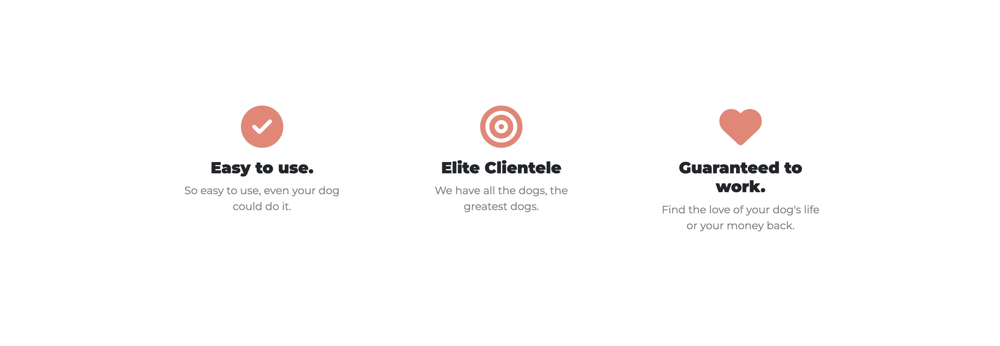
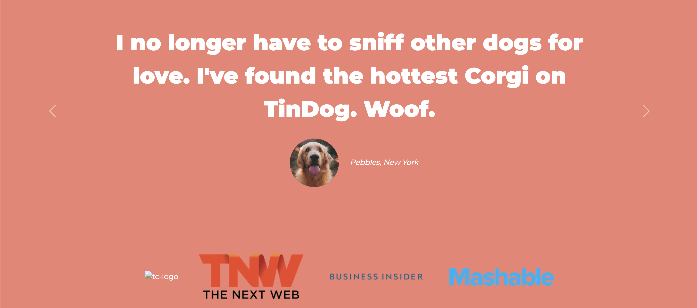
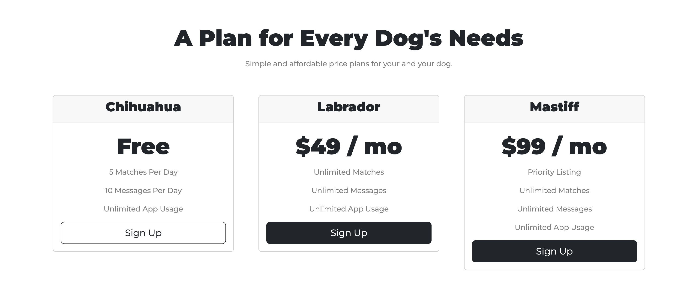
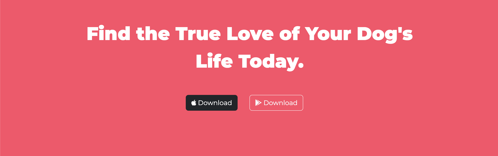

<h1>Tindog Site</h1>

This is a static responsive website called Tindog. This is a fun made-up dating site for real-life dogs that focuses on front-end development. This is built specifically using Bootstrap, HTML, and CSS.

<h2>Navbar Section</h2>

---

<h2>Title Section</h2>

---

<h2>Features Section</h2>

---

<h2>Testimonial & Press Section</h2>

---

<h2>Pricing Section</h2>

---

<h2>Call To Action Section</h2>

---

<h2>Footer & Social Media Section</h2>

